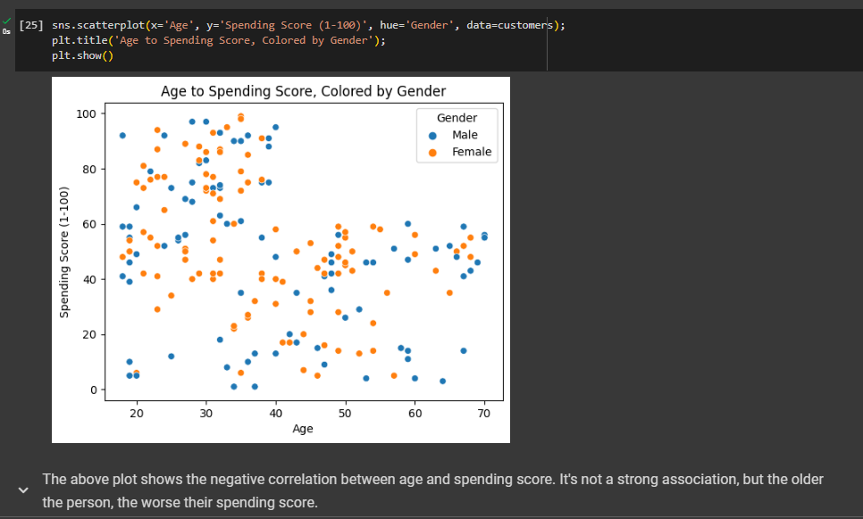

# customer-segmentation-analysis

I explore a data set on mall customers to try to see if there are any discernible segments and patterns. Customer segmentation is useful in understanding what demographic and psychographic sub-populations there are within your customers in a business case.

